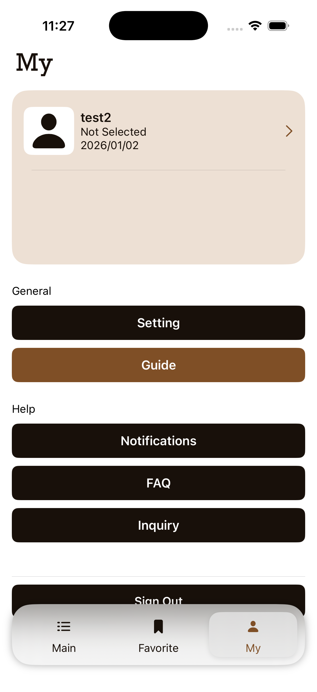

# Simple Platform App (SwiftUI)

A SwiftUI-based **platform-style iOS application** built with scalability and real-world release in mind.  
This project demonstrates modern SwiftUI architecture, clean UI composition, and extensible data modeling suitable for marketplace or intermediary services.

This repository currently uses **mock data** for demonstration purposes.  
Integration with **Firebase (Auth, Firestore, Storage, Cloud Functions)** is planned for future release.

---

## Overview

**Simple Platform** is an iOS app prototype that simulates a lightweight intermediary platform where users can:

- Browse vendors
- View vendor details
- Like (favorite) vendors
- Manage user profile
- Switch app language

The app follows MVVM architecture with reusable UI components and a clear migration path from mock data to Firebase backend.

---

## Screenshots

### Home / Vendor List

  
  
  

### Favorite & Profile

  
  

---

## Tech Stack

- SwiftUI (iOS 17+)
- MVVM Architecture
- Observable / ViewModel-driven state management
- Localization (Multi-language support)
- Mock Data Layer (Firebase-ready structure)
- Git / GitHub

---

## MVP1 – Implemented Features

### Vendor List
- Vendor list view with clean, scalable UI
- Category-based filtering (e.g. Studio, Dress, Hair & Make)
- Sorting options (Likes / Alphabetical)

### Like (Favorite) System
- Users can mark vendors they like
- Like count displayed per vendor
- Designed to support future server-side aggregation (Cloud Functions)

### Vendor Detail Page
- Vendor images
- Location information
- Like count display
- UI structure designed for future product and review expansion

### Profile
- User profile view
- Editable user information
- Prepared for authentication-based user data

### App Language Switching
- In-app language selection UI
- Localization via `Localizable.strings`

---

## MVP2 – Planned Features

- Vendor Chat: Real-time messaging between users and vendors
- Push Notifications
- Vendor Product / Service Details: price and description display

---

## Architecture Highlights

- **MVVM-first design**  
  Business logic in ViewModels keeps Views lightweight and composable.

- **Component-based UI**  
  Reusable components (buttons, headers, cards, loaders) improve maintainability.

- **Backend-ready Models**  
  Data models structured to seamlessly migrate from mock to Firebase.

---

## Firebase Integration (Planned)

This project is designed to eventually support:

- Firebase Authentication (User accounts)
- Cloud Firestore (Vendors, Likes, Chats)
- Firebase Storage (Vendor Images)
- Firebase Cloud Functions (server-side logic)

Mock data is currently used to keep the repository **self-contained and easy to review**.

---

## Screens & UI

- Clean, platform-style UI
- Modern SwiftUI layout practices
- Designed to scale across feature growth

---

## License

This project is licensed under the **MIT License**.  
See the [LICENSE](./LICENSE) file for details.

---
